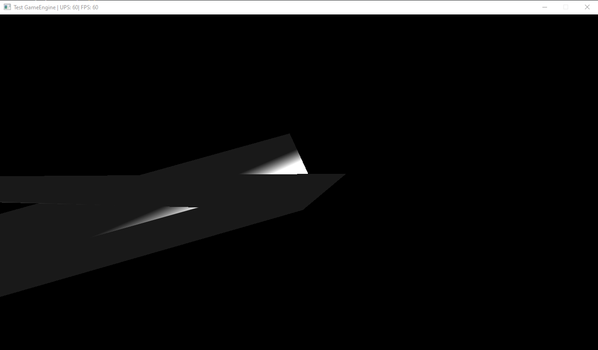

# Simple Java Game Engine

This is a project I did the first few months of freshman year of college, 2017. This was a fun project where I followed a tutorial to try to create a very simple game engine. It is made with Lightweight Java Game Library, which makes it sound easier to make but it is not, you have to handle the main game loop with all of it's timing calculations and then render to a screen using OpenGL.

So this was complicated but since it was a tutorial it was a little easier to follow. In the end I didn't actually get it fully working. All I wanted was to make it so I could render a cube. And my cube ends up horribly distorted like this:

I believe the reason this is happening is because the Math transform logic is very confusing. It's a bunch of Matrix math I did not know in freshman year so I couldn't really debug why it was not working. I did have at least a quad (a flat square) that could render, but I did not save the code when I did that so I don't have a screenshot of it.

Also the editor I used was IntelliJ, but if you compile `/src` with `javac` into another directory and copy everything from `/res` into that directory as well then you should be able to run it.